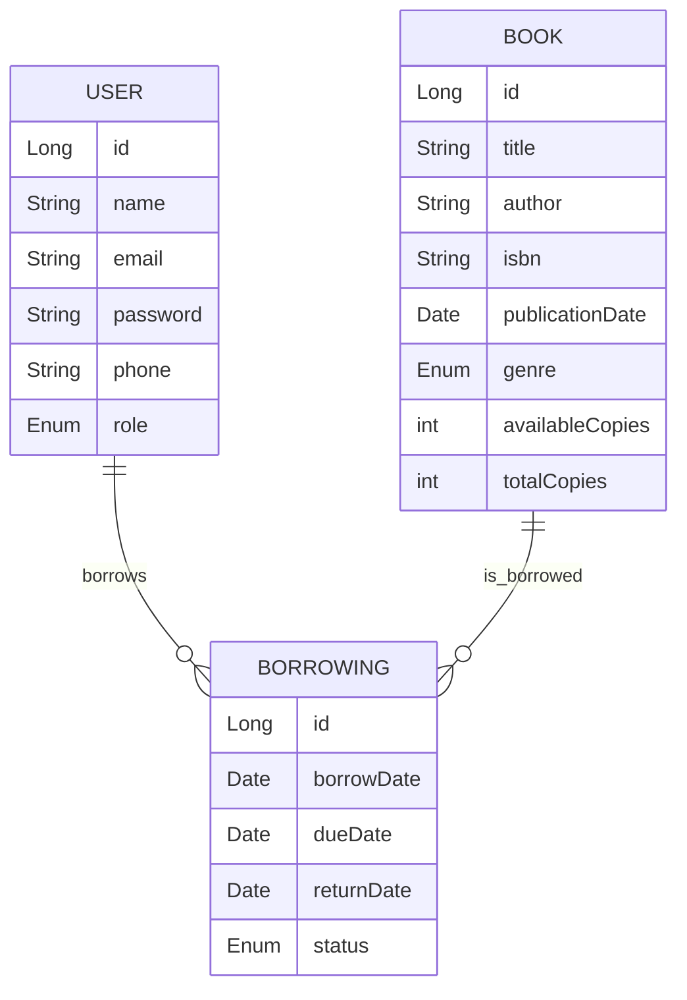

# 📚 Library Management System

Bu proje, Spring Boot 3 (Java 21), PostgreSQL ve JWT tabanlı kimlik doğrulama ile kapsamlı bir kütüphane yönetim sistemi sunar. Kütüphaneciler ve kullanıcılar için kitap, kullanıcı ve ödünç alma işlemlerini yönetir. Docker ile kolayca ayağa kaldırılabilir, testler için H2 veritabanı kullanır.

---

## 🚀 Özellikler

- **Kitap Yönetimi:** Kitap ekleme, güncelleme, silme, arama, detay görüntüleme
- **Kullanıcı Yönetimi:** Kayıt, güncelleme, silme, detay görüntüleme, rol yönetimi (kütüphaneci/patron)
- **Ödünç Alma/İade:** Kitap ödünç alma, iade, geçmiş görüntüleme, gecikmiş kitap raporu
- **Kimlik Doğrulama:** JWT ile güvenli giriş ve rol bazlı yetkilendirme
- **RESTful API:** Tüm işlemler için REST API
- **Swagger/OpenAPI:** API dokümantasyonu ([Swagger UI](http://localhost:8080/swagger-ui.html))
- **Testler:** H2 ile unit ve entegrasyon testleri
- **Logging:** Logback/SLF4J ile kapsamlı loglama
- **Docker:** Docker ve Docker Compose ile kolay kurulum
- **Reaktif Programlama:** Kitap stok durumu için gerçek zamanlı stream (WebFlux)
- **Postman Collection:** Tüm endpointler için önceden yapılandırılmış koleksiyon

---

## 🛠️ Teknoloji Yığını

- Java 21
- Spring Boot 3
- Spring Data JPA (Hibernate)
- Spring Security + JWT
- PostgreSQL (prod), H2 (test)
- Maven
- Docker, Docker Compose
- Swagger/OpenAPI
- JUnit, Mockito
- Logback, SLF4J

---

## ⚙️ Kurulum ve Çalıştırma

### 1. Kodu Klonla
```sh
git clone https://github.com/iremkvkpnr/library.git
cd library
```

### 2. Docker ile Çalıştır (PostgreSQL ile)
```sh
./mvnw clean package -DskipTests
docker-compose up --build
```
- Uygulama: [http://localhost:8080](http://localhost:8080)
- PostgreSQL: localhost:5432, user: postgres, pass: 123, db: librarydb

### 3. Lokal Geliştirme (H2 ile)
```sh
./mvnw spring-boot:run -Dspring-boot.run.profiles=h2
```
- H2 Console: [http://localhost:8080/h2-console](http://localhost:8080/h2-console)

### 4. Swagger/OpenAPI
- [http://localhost:8080/swagger-ui.html](http://localhost:8080/swagger-ui.html)

---

## 🗄️ Veritabanı Şeması



---

## 🔑 Varsayılan Kullanıcılar

- **Kütüphaneci:**  
  E-posta: `librarian@example.com`  
  Şifre: `admin123`

---

## 🧪 Testler ve Coverage

- Tüm unit ve entegrasyon testleri H2 profiliyle çalışır:
```sh
./mvnw test -Dspring.profiles.active=h2
```
- Test coverage raporu için:
```sh
./mvnw clean test jacoco:report
open target/site/jacoco/index.html
```

---

## 📬 Postman Collection

- Tüm endpointler için: `postman_collection.json` dosyasını Postman'a import edebilirsiniz.

---

## 📝 API Endpointleri ve Örnekler

- Tüm endpointler ve örnek istek/yanıtlar için Swagger/OpenAPI arayüzünü kullanabilirsiniz.

---

## 🧑‍💻 Katkı ve Kod Kalitesi

- Katmanlı mimari ve temiz kod prensipleri
- Exception handling ve logging uygulanmıştır
- Progressive commit geçmişi ve açıklamalı commit mesajları

---

## 📦 Docker ile Çalıştırma

- Tüm servisler tek komutla ayağa kalkar:
```sh
docker-compose up --build
```

---

## 🏁 Proje Tamamlandı

Tüm gereksinimler ve eklenmesi gerekenler eksiksiz olarak projede yer almaktadır. 