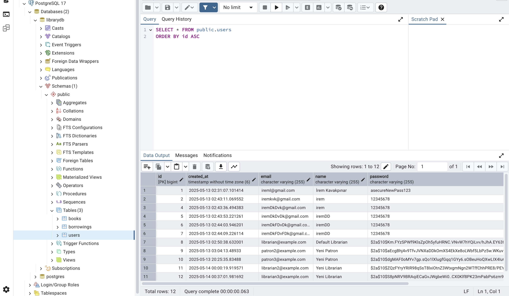
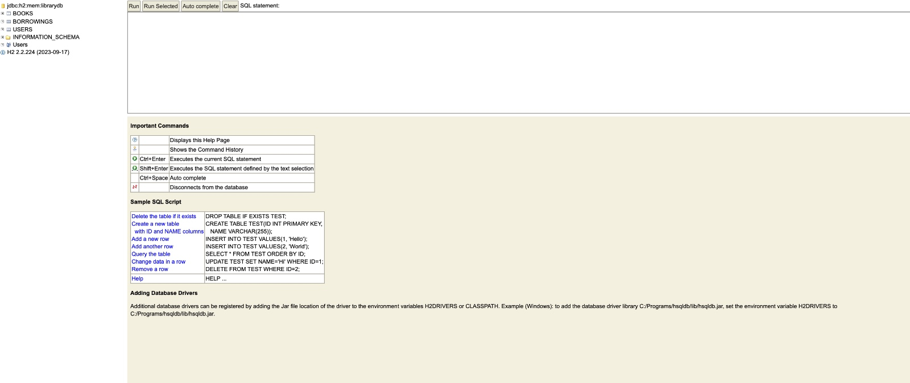
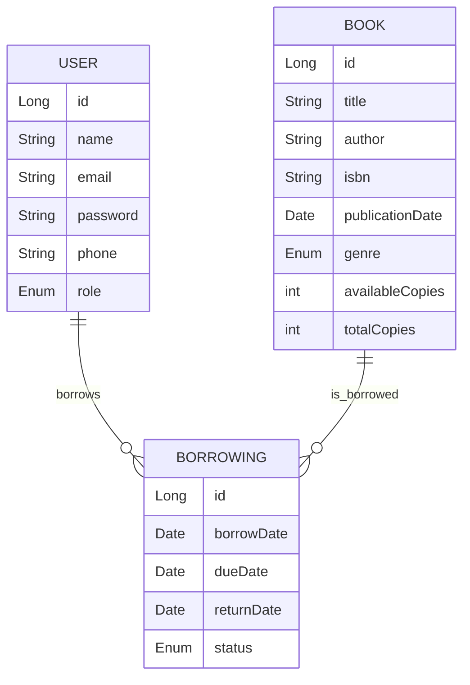
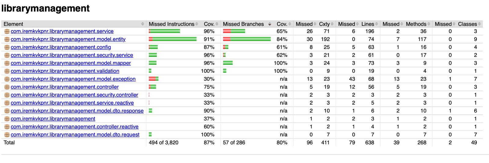
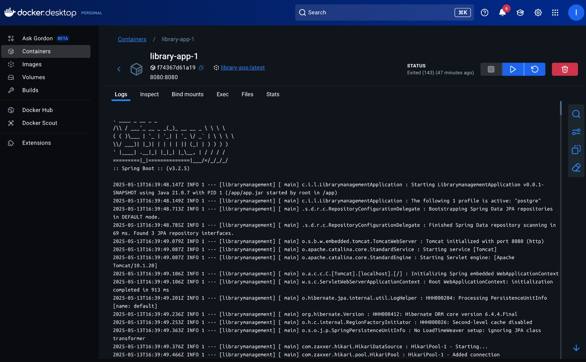

# 📚 Library Management System

This project provides a comprehensive library management system using Spring Boot 3 (Java 21), PostgreSQL, and JWT-based authentication. It manages books, users, and borrowing operations for librarians and patrons. Easily deployable with Docker, uses H2 for testing purposes.

---

## 🚀 Features

* **Book Management:** Add, update, delete, search, view details
* **User Management:** Register, update, delete, view details, role management (librarian/patron)
* **Borrowing/Returning:** Borrow books, return books, view history, overdue report
* **Authentication:** Secure login with JWT and role-based authorization
* **RESTful API:** REST API for all operations
* **Swagger/OpenAPI:** API documentation ([Swagger UI](http://localhost:8080/swagger-ui.html))
* **Testing:** Unit and integration tests using H2 database
* **Logging:** Comprehensive logging with Logback/SLF4J
* **Docker:** Easy setup with Docker and Docker Compose
* **Reactive Programming:** Real-time stream for book stock status (WebFlux)
* **Postman Collection:** Preconfigured collection for all endpoints

---

## 🛠️ Tech Stack

* Java 21
* Spring Boot 3
* Spring Data JPA (Hibernate)
* Spring Security + JWT
* PostgreSQL (prod), H2 (test)
* Maven
* Docker, Docker Compose
* Swagger/OpenAPI
* JUnit, Mockito
* Logback, SLF4J

---

## ⚙️ Setup and Run

### 1. Clone the Repository

```sh
git clone https://github.com/iremkvkpnr/library.git
cd library
```

### 2. Run with Docker (PostgreSQL)

```sh
./mvnw clean package -DskipTests
docker-compose up --build
```

* Application: [http://localhost:8080](http://localhost:8080)
* PostgreSQL: localhost:5432, user: postgres, pass: 123, db: librarydb



### 3. Local Development (with H2)

```sh
./mvnw spring-boot:run -Dspring-boot.run.profiles=h2
```

* H2 Console: [http://localhost:8080/h2-console](http://localhost:8080/h2-console)



### 4. Swagger/OpenAPI

* [http://localhost:8080/swagger-ui.html](http://localhost:8080/swagger-ui.html)

---

## 📄 Database Schema



---

## 🔑 Default Users

* **Librarian:**
  Email: `librarian@example.com`
  Password: `admin123`

---

## 🧪 Tests and Coverage

* Run all unit and integration tests with H2 profile:

```sh
./mvnw test -Dspring.profiles.active=h2
```

* For test coverage report:

```sh
./mvnw clean test jacoco:report
open target/site/jacoco/index.html
```



---

## 📬 Postman Collection

* Import the `postman_collection.json` file into Postman for all endpoints.

---

## 📝 API Endpoints and Examples

* Use the Swagger/OpenAPI interface to view all endpoints and sample requests/responses.

---

## 🧑‍💻 Contribution and Code Quality

* Layered architecture and clean code principles
* Exception handling and logging implemented
* Progressive commit history with descriptive messages

---

## 📦 Run with Docker

You can easily run this project using Docker and Docker Compose. Follow the steps below:

### Requirements

* [Docker](https://www.docker.com/products/docker-desktop) must be installed
* [Docker Compose](https://docs.docker.com/compose/) comes with Docker Desktop

### Steps

1. **Navigate to the project directory in terminal:**

   ```sh
   cd /Users/iremkavakpinar/librarymanegement/library
   ```

2. **Build and start Docker images and containers:**

   ```sh
   docker-compose up --build
   ```

   This command builds the images for the app and PostgreSQL and starts the containers.



3. **Access the application:**

    * Application: [http://localhost:8080](http://localhost:8080)
    * Default librarian account:

        * Email: `librarian@example.com`
        * Password: `password`

4. **To stop the containers:**
   Press `Ctrl+C` in terminal, or if running in background:

   ```sh
   docker-compose down
   ```

### Notes

* The app runs on Java 21 (eclipse-temurin-21).
* DB credentials defined in `docker-compose.yml`:

    * DB Name: `librarydb`
    * Username: `postgres`
    * Password: `postgres`
* DB data is persisted using Docker volume (`postgres_data`).

---

## ⚛️ If You Face Issues

* Ensure Docker is installed and running
* Confirm no other app is using port 8080 or 5432
* Check logs using:

```sh
docker-compose logs
```

---

## 🏁 Project Completed

All requirements and necessary features have been implemented successfully.

## ▶️ Start with Docker Compose

Follow these steps to run the project with Docker Compose:

1. Build and start containers:

```bash
docker-compose up --build
```

2. Stop all containers:

```bash
docker-compose down
```

3. To reset the database:

```bash
docker volume rm library_postgres_data
```

## 🛠️ Service Access

### From Host Machine

* The app is available at `localhost:8080`
* Sample request (to obtain JWT):

```bash
curl -X POST http://localhost:8080/api/v1/auth/authenticate \
  -H "Content-Type: application/json" \
  -d '{"email":"librarian@example.com","password":"admin123"}'
```

* After obtaining JWT token, access protected endpoints:

```bash
curl -X GET http://localhost:8080/api/books/search?page=0&size=10 \
  -H "Authorization: Bearer <JWT_TOKEN>"
```

### From Inside a Container

* Use the service name to access from another container:

    * Example: `http://app:8080`

## ⚠️ Important Notes

* Port mapping in `docker-compose.yml` enables access from the host machine.
* If the app is not accessible, check firewall, network settings, or config.
* Default librarian account:

    * Email: `librarian@example.com`
    * Password: `admin123`

## ✨ Extras

* This app comes with Swagger/OpenAPI documentation. Visit `http://localhost:8080/swagger-ui.html` in browser to explore all API endpoints.

Feel free to reach out if you encounter any issues or have questions.
