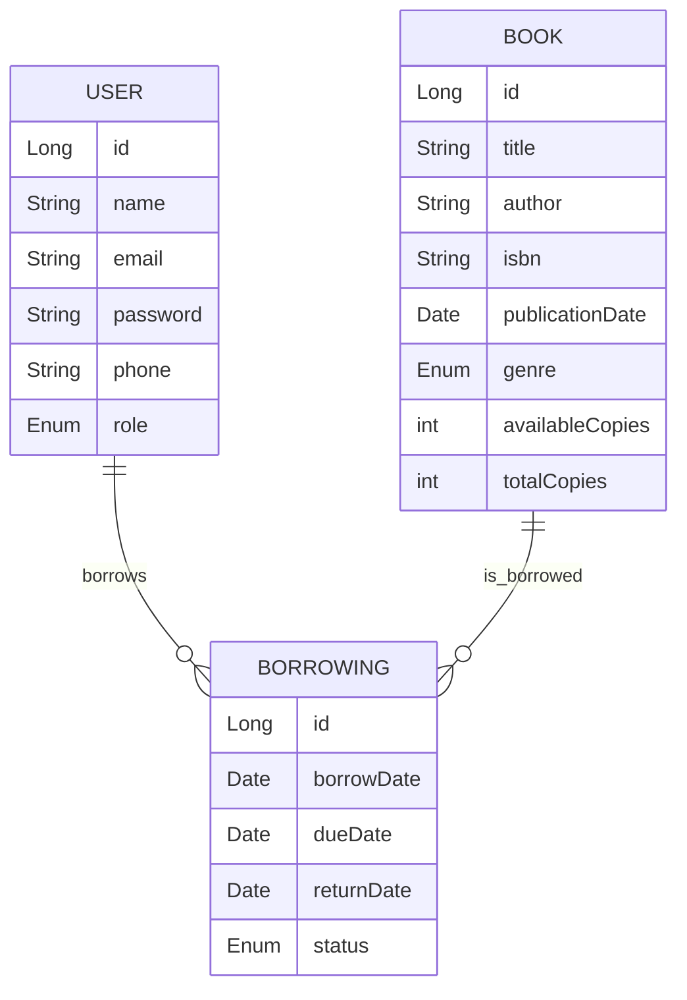

# 📚 Library Management System

Bu proje, Spring Boot 3 (Java 21), PostgreSQL ve JWT tabanlı kimlik doğrulama ile kapsamlı bir kütüphane yönetim sistemi sunar. Kütüphaneciler ve kullanıcılar için kitap, kullanıcı ve ödünç alma işlemlerini yönetir. Docker ile kolayca ayağa kaldırılabilir, testler için H2 veritabanı kullanır.

---

## 🚀 Özellikler

- **Kitap Yönetimi:** Kitap ekleme, güncelleme, silme, arama, detay görüntüleme
- **Kullanıcı Yönetimi:** Kayıt, güncelleme, silme, detay görüntüleme, rol yönetimi (kütüphaneci/patron)
- **Ödünç Alma/İade:** Kitap ödünç alma, iade, geçmiş görüntüleme, gecikmiş kitap raporu
- **Kimlik Doğrulama:** JWT ile güvenli giriş ve rol bazlı yetkilendirme
- **RESTful API:** Tüm işlemler için REST API
- **Swagger/OpenAPI:** API dokümantasyonu ([Swagger UI](http://localhost:8080/swagger-ui.html))
- **Testler:** H2 ile unit ve entegrasyon testleri
- **Logging:** Logback/SLF4J ile kapsamlı loglama
- **Docker:** Docker ve Docker Compose ile kolay kurulum
- **Reaktif Programlama:** Kitap stok durumu için gerçek zamanlı stream (WebFlux)
- **Postman Collection:** Tüm endpointler için önceden yapılandırılmış koleksiyon

---

## 🛠️ Teknoloji Yığını

- Java 21
- Spring Boot 3
- Spring Data JPA (Hibernate)
- Spring Security + JWT
- PostgreSQL (prod), H2 (test)
- Maven
- Docker, Docker Compose
- Swagger/OpenAPI
- JUnit, Mockito
- Logback, SLF4J

---

## ⚙️ Kurulum ve Çalıştırma

### 1. Kodu Klonla
```sh
git clone https://github.com/iremkvkpnr/library.git
cd library
```

### 2. Docker ile Çalıştır (PostgreSQL ile)
```sh
./mvnw clean package -DskipTests
docker-compose up --build
```
- Uygulama: [http://localhost:8080](http://localhost:8080)
- PostgreSQL: localhost:5432, user: postgres, pass: 123, db: librarydb

### 3. Lokal Geliştirme (H2 ile)
```sh
./mvnw spring-boot:run -Dspring-boot.run.profiles=h2
```
- H2 Console: [http://localhost:8080/h2-console](http://localhost:8080/h2-console)

### 4. Swagger/OpenAPI
- [http://localhost:8080/swagger-ui.html](http://localhost:8080/swagger-ui.html)

---

## 🗄️ Veritabanı Şeması



---

## 🔑 Varsayılan Kullanıcılar

- **Kütüphaneci:**  
  E-posta: `librarian@example.com`  
  Şifre: `admin123`

---

## 🧪 Testler ve Coverage

- Tüm unit ve entegrasyon testleri H2 profiliyle çalışır:
```sh
./mvnw test -Dspring.profiles.active=h2
```
- Test coverage raporu için:
```sh
./mvnw clean test jacoco:report
open target/site/jacoco/index.html
```

---

## 📬 Postman Collection

- Tüm endpointler için: `postman_collection.json` dosyasını Postman'a import edebilirsiniz.

---

## 📝 API Endpointleri ve Örnekler

- Tüm endpointler ve örnek istek/yanıtlar için Swagger/OpenAPI arayüzünü kullanabilirsiniz.

---

## 🧑‍💻 Katkı ve Kod Kalitesi

- Katmanlı mimari ve temiz kod prensipleri
- Exception handling ve logging uygulanmıştır
- Progressive commit geçmişi ve açıklamalı commit mesajları

---

## 📦 Docker ile Çalıştırma

Bu projeyi Docker ve Docker Compose kullanarak kolayca çalıştırabilirsiniz. Aşağıdaki adımları takip edin:

### Gereksinimler
- [Docker](https://www.docker.com/products/docker-desktop) yüklü olmalı
- [Docker Compose](https://docs.docker.com/compose/) yüklü olmalı (Docker Desktop ile birlikte gelir)

### Adımlar

1. **Proje klasörüne terminal ile girin:**
   ```sh
   cd /Users/ismaildemircan/librarymanegement/library
   ```

2. **Docker imajlarını ve konteynerleri başlatın:**
   ```sh
   docker-compose up --build
   ```
   Bu komut, hem uygulama hem de PostgreSQL veritabanı için gerekli imajları oluşturur ve konteynerleri başlatır.

3. **Uygulamaya erişim:**
   - Uygulama: [http://localhost:8080](http://localhost:8080)
   - Varsayılan kütüphaneci hesabı:
     - Email: `librarian@example.com`
     - Şifre: `password`

4. **Konteynerleri durdurmak için:**
   Terminalde `Ctrl+C` ile işlemi durdurabilir veya arka planda çalışıyorsa şu komutu kullanabilirsiniz:
   ```sh
   docker-compose down
   ```

### Notlar
- Uygulama Java 21 ile çalışmaktadır (eclipse-temurin-21).
- Veritabanı bilgileri docker-compose.yml dosyasında tanımlıdır:
  - Veritabanı adı: `librarydb`
  - Kullanıcı adı: `postgres`
  - Şifre: `postgres`
- Veritabanı verileri, Docker volume ile kalıcı olarak saklanır (`postgres_data`).

---

Herhangi bir hata ile karşılaşırsanız veya sorunuz olursa bana ulaşabilirsiniz.

---

## 🏁 Proje Tamamlandı

Tüm gereksinimler ve eklenmesi gerekenler eksiksiz olarak projede yer almaktadır.

## Başlatma (Docker Compose)

Projeyi Docker Compose ile başlatmak için aşağıdaki adımları izleyin:

1. Gerekli imajları ve container'ları oluşturup başlatmak için:

```bash
docker-compose up --build
```

2. Tüm container'ları durdurmak için:

```bash
docker-compose down
```

3. Veritabanı verisini sıfırlamak isterseniz:

```bash
docker volume rm library_postgres_data
```

## Servislere Erişim

### Host Makineden (Bilgisayarınızdan)

- Uygulama, host makinenizde `localhost:8080` üzerinden erişilebilir olur.
- Örnek istek (JWT almak için):

```bash
curl -X POST http://localhost:8080/api/v1/auth/authenticate \
  -H "Content-Type: application/json" \
  -d '{"email":"librarian@example.com","password":"admin123"}'
```

- JWT token aldıktan sonra, korumalı endpointlere erişmek için:

```bash
curl -X GET http://localhost:8080/api/books/search?page=0&size=10 \
  -H "Authorization: Bearer <JWT_TOKEN>"
```

### Container İçinden

- Eğer başka bir container'dan bu uygulamaya istek atacaksanız, servis adını kullanmalısınız:
  - Örnek: `http://app:8080`

## Önemli Notlar

- `docker-compose.yml` dosyasında port yönlendirmesi sayesinde host makineden erişim mümkündür.
- Eğer uygulamaya erişemiyorsanız, firewall, network veya uygulama konfigürasyonunu kontrol edin.
- Varsayılan kütüphaneci hesabı:
  - Email: `librarian@example.com`
  - Şifre: `admin123`

## Ekstra

- Uygulama Swagger/OpenAPI dokümantasyonu ile birlikte gelir. Tarayıcıdan `http://localhost:8080/swagger-ui.html` adresine giderek API endpointlerini inceleyebilirsiniz. 